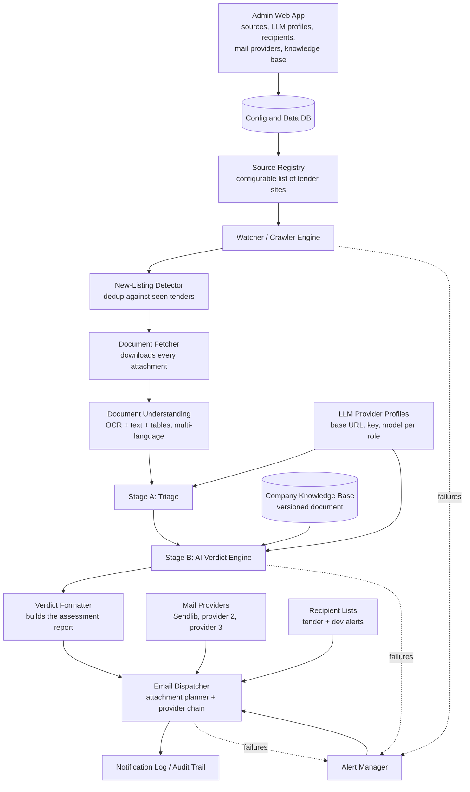

# 02 — Technical Architecture

> Source of truth: v1.1 §1–§6. Technology names from v1.1 §9 are **proposed implementation choices** (guidance, not mandate) and are labelled as such. Where v1.1 and v1.0 disagree, v1.1 wins.

## 2.1 Overview

Tender Intelligence is a **headless worker** at the core, plus a **thin admin web application** over a **shared relational database**, plus **document storage**. The worker and admin app are independent processes sharing only the database and document storage; the worker must keep operating when the admin app is unavailable.



## 2.2 Headless worker

- Scheduled process(es) with **no UI**.
- Responsibilities: crawl sources, detect new/updated tenders, fetch documents, extract text, run triage and verdict, send email, write logs and alerts.
- **Re-reads configuration at the start of every run; never caches settings across runs.**
- One pipeline run per source per schedule; each tender and each pipeline run gets a **correlation ID**.
- Presents as a *[proposed implementation choice]*: a scheduled script or lightweight job queue (v1.1 §9 notes cron, Celery, or a basic scheduled script are fine at this scale).

## 2.3 Admin web application

- Thin web UI + API reading/writing the same database.
- Responsibilities (confirmed screens in v1.1 §5.11): health dashboard, sources, tenders/timelines, knowledge base, LLM providers, recipients, mail providers, triage & urgency, settings, audit log.
- **Does not run crawls inline.** "Test this source" and "Test connection" are **dry runs** that write nothing to the seen-tenders table and send nothing to business recipients.
- If the admin app is down, the worker keeps running on the last saved configuration.
- Requires authenticated users; two roles (Admin, Viewer) are **[PROPOSED]**; exposure of KB/secrets to viewers is prohibited.
- *[Proposed implementation choice]*: the admin web stack is not specified by the source; it may differ from the worker language as long as they share the database and schema.

## 2.4 Shared relational database

- Holds configuration *and* operational data, so an admin change is picked up by the worker on its next run — no redeploy, no restart.
- *[Proposed implementation choice]*: v1.1 §4.1 says "Postgres is fine"; §9 says "a relational database". The source does not mandate a specific engine.

## 2.5 Document storage

- Raw documents copied from source URLs (which can rot), with original filenames retained.
- *[Proposed implementation choice]*: object storage "or a well-organized filesystem/bucket"; secure expiring links are served from this archive (v1.1 §9).
- Physical location is an **open decision** (`docs/13-open-decisions.md` #8).
- Also stores knowledge-base content (versioned).

## 2.6 Pipeline architecture

Stages (see `docs/04-pipeline-spec.md` for the full spec):

1. Source Registry
2. Watcher / Crawler Engine
3. New-Listing Detection / Deduplication (+ update detection)
4. Document Fetcher
5. Document Understanding
6. Stage A — AI Triage
7. Stage B — AI Verdict
8. Verdict Formatter
9. Email Dispatcher (attachment planner + provider chain)
10. Notification Log / Audit Trail

Each stage writes a **status** (success/failure/warning) with a machine-readable error code, stamped with the correlation ID, so a tender's timeline is reconstructable.

## 2.7 Configuration flow

```text
Admin app (or initial config file)  →  Shared DB  →  Worker (re-read at run start)
```

- Config file is the minimum bar; the admin web app is the target (v1.1 §5.8, §9).
- Version-controlled YAML/JSON for the very first run, then database-backed admin app.
- Worker validates active sources on startup and on reload; logs warnings, never crashes.
- Configuration changes are audit-logged in `ConfigChangeLog` (never secret values).

## 2.8 Provider abstraction (LLM)

- `LLMClient` interface (single code touchpoint for model calls).
- Profiles: `base_url`, `api_key` (encrypted, write-only), `model`, `context_window_tokens`, call params, capability flags (`supports_json`, `supports_vision`), cost fields, `approved_for_company_docs`, `active`.
- Role assignment: `triage`, `verdict`, `embeddings` (deferred), `vision_ocr` (optional). Each role may name a fallback profile.
- Retry with backoff (default 2) then fallback; **fallback obeys the same `approved_for_company_docs` data policy.**
- Standardised on the OpenAI-compatible chat shape *[PROPOSED, decision D4]*.
- Per-call usage logging (`LLMCall`: tokens, latency, estimated cost, profile used).

## 2.9 Source adapter abstraction

- `SourceAdapter` interface: `list_new_tenders()`, `get_detail(tender_id)`, `get_attachments(tender_id)`.
- One adapter per `source_type` (Paginated HTML, Filtered/faceted HTML, Search-form-driven, RSS/Atom, JSON API). New site of a known type = config change only.
- WAHO implemented in Phase 1; TenderDetail, All Business Africa, UNGM in Phase 3 (each = config or one new adapter).
- See `docs/05-source-adapter-spec.md`.

## 2.10 Document processor abstraction

- Converts fetched files into a reusable structured "document bundle" (plain text + metadata per document).
- Must handle native PDF, scanned PDF (OCR), DOCX, ZIP (unzip + recurse), tables, multi-language.
- Per-document failures must not block other documents on the same tender.
- See `docs/06-document-processing-spec.md`.

## 2.11 Mail provider abstraction

- `MailProvider` interface, one adapter per provider type (Sendlib first).
- Provider chain of 2–3 with failover, circuit breaker, per-attempt records.
- Attachment planner: compute message attachment set → pick first provider whose capabilities fit → attach what fits, link the rest → log attached-vs-linked.
- See `docs/08-email-notification-spec.md`.

## 2.12 Alerting

- Dedicated alert path to the **dev alert recipient list**, through the same provider chain.
- Throttled: one alert on unhealthy, one on recovery, reminders at configurable intervals.
- Messaging failure fallback: if the whole chain is down, the **persisted red banner in the health view is the fallback signal**.
- See `docs/04-pipeline-spec.md` §Alerting and `docs/08-email-notification-spec.md`.

## 2.13 Audit logging

- `ConfigChangeLog`, `RunHistory`, `NotificationLog`, per-stage statuses, correlation IDs.
- Retention minimum (e.g. 12 months, configurable) for run history, stage logs, verdicts.
- Third-party provider logs are never relied upon as the audit source of truth.

## 2.14 Correlation IDs

- Assigned the moment a tender is first detected; also per pipeline run.
- Stamped on every log line, DB row, and error.
- Enables the "what happened to tender X?" one-linear-timeline requirement.

## 2.15 Test Mode

- Global switch; **ON by default until go-live**.
- ON ⇒ all tender emails go only to the dev list, subject prefixed `[TEST]`; turning off is explicit + audit-logged.
- Dry runs write nothing to seen-tenders and email no one.
- Knowledge base must be a non-sensitive placeholder while an unapproved profile handles the verdict role.

## 2.16 Worker/admin independence rules

- Worker re-reads config at the start of every run (never caches across runs).
- Admin never runs crawls inline; admin test actions are dry runs.
- Worker continues on the last saved configuration if the admin app is down.

## 2.17 Key architectural invariants (non-negotiable)

1. Headless worker and admin app are separate concerns; worker is primary.
2. No silent failures — every breakage alerts the dev list and is logged.
3. No duplicate notifications in normal operation (idempotency).
4. Every secret is encrypted at rest, write-only, never logged.
5. LLM/mail/source/document providers are swappable via configuration or a single new adapter.
6. RAG/vector retrieval is **not** part of v1.

## 2.18 Historical note (v1.0)

v1.0 described a single pipeline ("six stages") and "any capable model API" with per-file knowledge-base documents (RAG as a v1 component). v1.1 replaced the per-file KB with a single versioned document and postponed RAG. v1.0 also had no recipient-list separation, no mail provider chain, no Test Mode, and a single ~20 MB attachment threshold. None of the v1.0-only statements are requirements in v1.1.