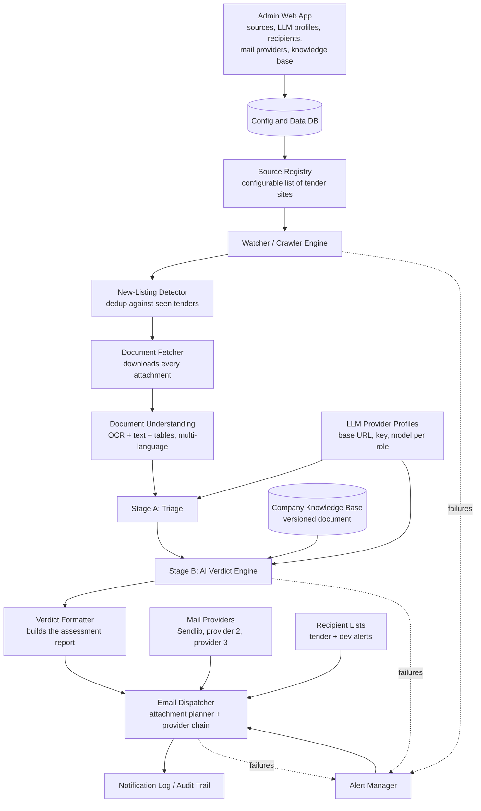

# Tender Intelligence & Auto-Notification System

### Technical Specification — v1.1 (revision of v1.0)

**Prepared for:** OPEX Consulting Limited / RegTech365
**Original specification (v1.0) by:** Emmanuel (Senior Product Manager)
**Revision:** v1.1 — developer-side additions, decisions and research merged in
**Revision date:** 21 September 2026
**Audience:** Developers building the system, and OPEX stakeholders reviewing it

> **How to read this document.** Sections 1–4 and most of §5–§6 are carried over from v1.0 with light edits. New or substantially rewritten content is marked **[NEW in v1.1]** or **[REVISED in v1.1]**. Items that are proposals and need OPEX confirmation are marked **[PROPOSED]**. Items intentionally postponed are marked **[DEFERRED]**.

---

## 0. Revision Summary [NEW in v1.1]

### 0.1 What changed from v1.0

| Area | v1.0 | v1.1 |
|---|---|---|
| Application type | Not specified | Headless worker at the core, plus a thin admin web app for configuration (§4.1, §5.11) |
| LLM | "Any capable model API" | Admin-configurable **LLM provider profiles** (base URL, API key, model) assigned per role, with fallback (§5.9) |
| Recipients | One bullet: "configurable per source or globally" | Two separate lists (tender recipients, dev alert recipients) with routing rules (§5.10) |
| Email delivery | "Any transactional email API or SMTP" | A **mail provider chain** of 2–3 services with failover; Sendlib is the first provider (§5.10) |
| Attachments | Attach everything, link if over ~20 MB | Capability-aware **attachment planner** that respects each provider's limits (§5.7, §5.10) |
| Knowledge base | Uploadable store with RAG | v1: one structured, **versioned document** read directly by the verdict engine; RAG becomes phase 2 (§5.5) |
| System alerts | "Notify OPEX via email" | Routed to a dedicated **dev alert list**, throttled, with a chain-wide-failure fallback (§5.2, §5.10) |
| Safe testing | Not addressed | **Test Mode** and per-provider data-handling flag (§5.9, §5.12) |
| Verdict traceability | Model version stored | Provider profile, model, knowledge-base version and prompt version stored per verdict (§5.6, §7) |

### 0.2 Decision log

| # | Decision | Status |
|---|---|---|
| D1 | Core is a headless script/worker with no frontend; a web app is added for admin purposes only | Confirmed |
| D2 | For testing, use the developer's own DeepSeek API access (an NVIDIA-hosted API that serves DeepSeek is an alternative) | Confirmed as test plan |
| D3 | For production, OPEX supplies credentials for its paid model (believed to be a GPT-4-class "mini"; exact model TBD) | Deferred (model name) |
| D4 | Standardise on the **OpenAI-compatible chat API shape** so switching provider is a settings change | Proposed |
| D5 | Company knowledge base is a document the system reads (v1), not a vector store | Confirmed |
| D6 | Recipients are set in the system (admin UI) and emails go out through a mail service | Confirmed |
| D7 | A separate **dev recipient list** receives system alerts | Confirmed |
| D8 | Mail service uses a **fallback chain of 2–3 providers**; **Sendlib** is used first because it needs no domain | Confirmed |
| D9 | **Test Mode** routes tender emails to the dev list only until go-live | Proposed |
| D10 | Each LLM profile carries an `approved_for_company_docs` flag; knowledge-base content is only sent to approved profiles | Proposed |
| D11 | SPF/DKIM DNS setup on a sending domain | Deferred |
| D12 | Knowledge-base document template | Deferred |

### 0.3 Corrections to v1.0 text

- The data-model list had no section heading and was attached to the end of §6.1. It is now its own section, **§7**.
- §5.1 referred to `parser_config` "(see 5.2)". The parser configuration is defined in §5.1 itself; the reference is fixed.
- §11 said the email contains "all six sections/fields described in §8", but §8 defines **three sections plus attachments**. The acceptance criterion now matches §8.
- §8 only covered the new-tender email. Proposed templates for **tender updates** and **system alerts** are added (§8.2, §8.3).

---

## 1. Problem Statement

On the morning of **18 September 2026**, someone at OPEX Consulting finally opened the WAHO tender portal and found this:

> *"The West African Health Organization (WAHO), under AfDB Grant No. 2100155041318, has invited Expressions of Interest for consultancy services relating to the development of a regional pharmaceutical product traceability system... The deadline for the EOI submission is today, Friday, 18 September 2026, at 1:00 PM Nigerian time."*

It was already too late. The notice had been live for weeks. By the time anyone at OPEX read it, there were hours left, not days — and even if there had been time, nobody had pulled together the "why we cannot apply" gaps in advance: no demonstrable GS1/traceability experience on file, no pre-assembled reference table, no consortium lined up to cover the GS1-certified Lead Consultant requirement. The opportunity wasn't lost because OPEX was unqualified to *pursue* it — it was lost because nobody was watching, and even when someone did look, there was no fast way to tell "is this even worth our time" from "this is a must-apply."

This is not a one-off. OPEX and RegTech365 sit inside a market — GRC, ITGRC, fintech regulatory technology, compliance platforms — where the highest-value opportunities are published by scattered, differently-structured bodies: regional health/development bodies like WAHO, UN agencies through UNGM, commercial aggregators like TenderDetail, pan-African platforms like All Business Africa, and others that will appear over time. Each of these publishes dozens to thousands of notices, in multiple languages, most of which are irrelevant to OPEX's actual capabilities. A human checking five to ten sites a day, reading every notice and every attached PDF, and then judging fit against OPEX's real track record, is not a sustainable process — it's exactly how the WAHO deadline was missed, and it is how the next ten will be missed too.

**What OPEX actually needs** is a system that never sleeps: it watches a *configurable* list of tender sources, picks up new postings automatically, pulls down every attached document (RFPs, TORs, annexes — regardless of format or language), reads and understands them, and then — using a living record of what OPEX/RegTech365 has actually done, is certified for, and can credibly claim — renders a verdict: **apply, or don't, and why**, in a format the team can act on within minutes, not days. That verdict has to arrive as an email, with every supporting document already attached, before the deadline is a rounding error away.

This document specifies that system.

---

## 2. Goals

1. **Never miss a relevant high-value tender again** because nobody was watching a source.
2. **Cut evaluation time from hours to minutes** by having AI produce a structured go/no-go verdict, not just a raw notice.
3. **Ground every verdict in OPEX's real capability record**, not generic guesswork — via a growable, versioned knowledge base of company information.
4. **Make sources pluggable**: adding WAHO, UNGM, TenderDetail, All Business Africa, or any future source should be a configuration change, not a code change.
5. **Never lose a document**: every attachment on a tender notice must be captured and delivered with the notification (attached, or reliably linked when a provider's limits prevent attaching).
6. **Support multiple languages and document formats** without manual pre-processing (WAHO notices are routinely French/English/Portuguese; documents arrive as PDF, DOCX, ZIP).
7. **Be provider-agnostic** *[NEW in v1.1]*: the LLM provider (base URL, key, model) and the mail provider(s) can be changed from an admin screen without a code change or redeploy.
8. **Be safe to test** *[NEW in v1.1]*: the system can run end to end against real sources without sending half-finished output to OPEX staff, and without exposing company documents to untrusted providers.
9. **Fail loudly, never silently** *[NEW in v1.1]*: developers are alerted through a dedicated channel the moment a source, an AI call, or the email path breaks.

---

## 3. Non-Goals (for this version)

- The system does **not** submit applications on OPEX's behalf. It notifies humans, who apply.
- It does **not** need to cover every tender site on the internet on day one — it needs to make adding the *next* one trivial.
- Slack/Teams/SMS notification is out of scope for v1 — **email only**, as explicitly requested. Design the notification layer so other channels can be added later without rework (see §9).
- A vector database / embeddings pipeline is **not** part of v1 *[NEW in v1.1]*. It is a planned phase-2 upgrade (see §5.5).
- Multi-tenant hosting (several companies on one installation) is out of scope.

---

## 4. System Overview

### 4.1 Application type [NEW in v1.1]

The original idea was an **invisible script that runs with no frontend**. That remains the design of the *core*. A web app is added only because non-technical staff need a safe place to manage configuration (decision D1).

| Component | What it is | Responsibilities |
|---|---|---|
| **Worker (headless)** | Scheduled process(es), no UI | Crawl sources, detect new/updated tenders, fetch documents, extract text, run triage and verdict, send email, write logs and alerts |
| **Admin web app** | Thin web UI + API over the same database | Manage sources, LLM provider profiles, recipients, mail providers, the knowledge base, triage/urgency thresholds; view health, run history, and per-tender timelines |
| **Shared database** | Relational DB (Postgres is fine) + document storage | Holds configuration *and* operational data, so a change made in the admin app is picked up by the worker on its next run — **no redeploy, no restart** |

Rules that keep the two halves independent:

- The worker **re-reads configuration at the start of every run**. It never caches settings across runs.
- The admin app does not run crawls inline. Its "Test this source" and "Test connection" buttons run **dry runs** that write nothing to the seen-tenders table and send nothing to business recipients.
- If the admin app is down, the worker keeps running on the last saved configuration.

### 4.2 Pipeline

At a high level, the system is a pipeline wrapped by a configuration layer, a knowledge base, and an alerting path:



**In plain language:** the Watcher checks each configured source on a schedule. When it finds a listing it hasn't seen before, it downloads the listing page and every document attached to it. It extracts the actual text/content of those documents (even scanned PDFs, even French). A cheap triage step discards obviously irrelevant notices. For the rest, it feeds the extracted content plus OPEX's own capability record to an AI model whose only job is to answer: *is this relevant, can we credibly bid, and why or why not*. It writes that answer into the exact report format OPEX already uses (see §8), and emails it to the configured recipients with the original documents attached (or linked, where a mail provider's limits require). Everything that happens is logged so nothing is sent twice and nothing silently fails, and any breakage raises an alert to the developers.

---

## 5. Functional Requirements

### 5.1 Source Registry (dynamic configuration)

This is the piece that makes the system extensible. Sources must **not** be hardcoded.

- Each source is a record with, at minimum:
  - `name` (e.g. "WAHO Tenders")
  - `base_url` / `listing_url`
  - `source_type` — an enum describing how to read it (see below)
  - `crawl_frequency` (e.g. every 6 hours)
  - `language(s)` expected
  - `auth` (if the source requires login/API key — optional, encrypted at rest)
  - `active` flag (true/false — lets ops disable a source without deleting its history)
  - `parser_config` — a small structured block telling the crawler how to find listing rows, detail links, and attachment links on that specific site
  - `recipient_scope` *(optional, [NEW in v1.1])* — restricts which tender recipients receive emails from this source (see §5.10)
- Sources must be addable, editable, and disable-able **without a code deployment**. At minimum this means a config file (YAML/JSON) reloaded on schedule, or — better, for a non-technical user — the admin screen (§5.11) with a form and a "Test this source" button that runs one dry crawl and shows what it found.
- On startup and on each config reload, the system validates every active source is reachable and logs a warning (not a crash) for any that isn't.

**Source types to support from day one** (each site structures its tenders differently, so the crawler needs a strategy per type, not one hardcoded scraper):

| Type | Example | Notes |
|---|---|---|
| Paginated HTML list | WAHO Tenders, TenderDetail | Follow "next page" links until no new items found |
| Filtered/faceted HTML list | All Business Africa (`?status=open`) | Respect query-string filters defined in config |
| Search-form-driven | UNGM (requires submitting a search form, no static listing) | Needs a small per-source adapter that fills and submits the form, or uses the site's API/export if one exists |
| RSS/Atom feed | (future sources may offer this) | Trivial to add — treat as its own type |
| JSON API | (future sources, e.g. OCDS-based portals like South Africa's eTenders, which All Business Africa itself links to) | Prefer this over HTML scraping wherever a source exposes one |

> **Design note for the developer:** don't try to build one universal scraper that "understands" any tender site. Build a small `SourceAdapter` interface (`list_new_tenders()`, `get_detail(tender_id)`, `get_attachments(tender_id)`) and implement one adapter per `source_type`. Adding a new *site* of a type you already support (e.g. another paginated-HTML tender board) should require **only a new config entry**, not new code. Adding a genuinely new *type* of site is the only case that needs new code — and even then, only a new adapter class.

### 5.2 Watcher / Crawler Engine

- Runs each active source on its configured schedule.
- Must be **polite**: respect `robots.txt` where present, rate-limit requests, use a real user agent, and back off on errors rather than hammering a site.
- Detects **new** listings only — needs a persistent record of tender IDs/URLs already seen per source (see §7 data model), so re-runs don't reprocess or re-notify on the same tender.
- Must also detect **updates** to a previously-seen tender (e.g. a new addendum document, or an extended deadline) as a distinct, lower-priority event — this matters a lot for WAHO-style notices where documents get added after initial publication. Update emails follow the template in §8.2.
- On a source-level failure (site down, structure changed, blocked), log the failure with enough detail to debug and **raise a system alert** (§5.10.4) — a silently broken watcher is worse than no watcher, because it creates false confidence. *[REVISED in v1.1: v1.0 said "notify OPEX via email"; system alerts now go to the dedicated dev alert list, and optionally to a business "operations" list if OPEX wants one.]*

### 5.3 Document Fetcher

- For every new (or updated) tender, download **every** linked document on its detail page — RFPs, TORs, annexes, EOI forms, procurement plans, ZIP archives (unzip and recurse).
- Preserve original filenames and source URLs; store a local/cloud copy (don't rely on the source URL remaining valid — WAHO/TenderDetail links can rot).
- Record file type, size, language (best guess), and a checksum, so duplicate attachments aren't refetched or re-sent.
- Handle failures per-document (one broken link shouldn't block the other nine documents on the same tender) and flag missing documents in the eventual verdict/email rather than failing silently.

### 5.4 Document Understanding

This is the "read and understand the attached documents" requirement, and it has to work across:

- **Native PDFs** — direct text extraction.
- **Scanned/image PDFs** — OCR (the WAHO TORs and AMI notices are frequently scanned or mixed). *[NEW in v1.1]* If the assigned LLM profile has `supports_vision = true`, page images can optionally be sent to the model instead of, or as a fallback to, a separate OCR engine. Test both on real scanned WAHO documents before choosing a default.
- **DOCX** — direct text extraction (WAHO explicitly publishes `.docx` TORs).
- **Multi-language content** — WAHO alone publishes in French, English, and Portuguese in the same notice. Extraction must preserve/tag language so the AI stage can work in the right language, or translate to a working language before assessment.
- **Tables** — deadlines, eligibility criteria, and evaluation matrices are frequently in tables; a naive text dump loses structure that matters for the verdict (e.g. "10+ years' experience" as a line item).

**Output of this stage:** one structured "document bundle" per tender — plain text + metadata per document, ready to hand to the AI stage. This bundle should be reusable (don't re-OCR the same PDF twice if the AI stage is re-run).

### 5.5 Company Knowledge Base ("what we do / have done") [REVISED in v1.1]

This is the piece that makes the AI verdict *specific to OPEX* instead of generic.

**v1 approach (decision D5): a document the system reads.** OPEX's capability record is maintained as one structured document (or a small number of them). The verdict engine reads the whole current version directly — no embeddings, no vector store, no retrieval step. This is deliberately simple: for a company profile of moderate size it fits comfortably in a model's context window, and it removes an entire component (and an embedding provider) from v1.

Requirements:

- **Editable without a deployment.** Via the admin app (§5.11): upload a file (`.docx`, `.pdf`, `.md`, `.txt`) or paste/edit text. As OPEX completes projects or gains certifications, someone updates the document.
- **Versioned.** Every save creates an immutable **knowledge-base version** with a content hash and timestamp. Every verdict records the version it was based on, so "why did the system say that in October?" is always answerable (see §5.6 and §7).
- **Structured.** The document should follow a consistent layout so the AI can find evidence reliably. Suggested sections: company profile and legal status; core capabilities and services; past projects (client, sector, country, value, year, role, outcome); certifications and accreditations (ISO, GS1, etc.); key staff and qualifications; consortium/partner relationships; **known gaps**; and **sectors, regions and contract types OPEX wants to pursue or skip** (this last section also feeds triage, §5.6). *The exact template is deferred (Appendix A).*
- **Token-budget guard.** The system counts the knowledge-base tokens and compares them to the assigned profile's `context_window_tokens`. If the knowledge base plus a typical tender bundle would exceed a configurable share of the window (default **[PROPOSED]** 40%), the admin app shows a warning recommending the phase-2 retrieval upgrade.
- **Access-controlled.** The document may contain sensitive company and financial information (see §6.2).

**Phase-2 upgrade path (RAG).** When the knowledge base outgrows the context budget, or when OPEX wants to attach many separate files (CVs, certificates, completion letters), add a retrieval store: each upload carries metadata (document type, date, tags, a short human-written summary), and the verdict engine retrieves only the most relevant items per tender by tag/keyword and semantic similarity. This requires an **embedding model**, which is configured as its own role in §5.9. Keep the verdict engine's interface (`get_knowledge_context(tender_bundle)`) stable so switching from "whole document" to "retrieved slice" changes only the implementation behind it.

### 5.6 AI Relevance & Verdict Engine [REVISED in v1.1]

Given a tender's extracted document bundle **and** the current knowledge-base version, the AI stage must produce a structured verdict containing exactly the sections OPEX already uses (see §8 for the full template), in particular:

1. **Background** — plain-language summary of what's being procured, who's procuring it, reference/grant numbers, and the scope.
2. **Requirements** — extracted eligibility criteria, required experience, required documents/evidence, deadline (date **and** time, with timezone — this is what got missed last time).
3. **Why we can/cannot apply** — the actual gap analysis: for each requirement, does OPEX's knowledge base show evidence of meeting it, partially meeting it, or not meeting it at all? This section must **name the specific gap** (e.g. "no GS1-certified Lead Consultant on file"), not just say "not a fit."
4. A **verdict/recommendation** field: `APPLY`, `DO NOT APPLY`, or `APPLY WITH CONDITIONS` (e.g. "only if we can secure a GS1-certified partner within N days"), plus a confidence score.
5. A **deadline urgency flag** — if the deadline is within a configurable threshold (e.g. 5 business days), mark it urgent regardless of the verdict, so a borderline-relevant but time-critical notice doesn't get buried.

**Two-stage AI processing** is recommended rather than one big call per tender:

- **Stage A — cheap triage:** a lightweight pass (can even be rule/keyword-based initially) that filters out obviously irrelevant notices (wrong sector entirely, wrong region, etc.) before spending a full AI call on it. This matters because sources like All Business Africa or TenderDetail publish thousands of unrelated notices (school furniture, army boots, road maintenance) — most of it should never reach the expensive AI step. Triage rules are **admin-configurable** (§5.8): include/exclude keywords, target sectors and regions, optional minimum contract value, and the relevance threshold. Defaults come from the "sectors, regions and contract types" section of the knowledge base. *The actual target profile is an open question for OPEX (§12.3).*
- **Stage B — full assessment:** only for what survives triage, run the full document-understanding + knowledge-base + verdict generation described above.

**Quality rules for the verdict** *[NEW in v1.1, PROPOSED]*:

- **Evidence-cited matches.** Every "meets requirement" claim must cite the knowledge-base section it relies on. A claim with no citation is downgraded to "unverified."
- **"No evidence on file" wording.** The knowledge base is a record of what OPEX has documented, not proof of what OPEX lacks. Gap statements should read "no evidence on file for X" rather than "OPEX does not have X," so a human knows to check before dismissing a tender.
- **Structured output, validated.** The model is asked for JSON matching a schema. Invalid output is retried once; if it still fails, the tender is marked `verdict_failed`, an alert is raised, and the raw notice is still emailed (with a clear "automatic assessment unavailable" banner) so nothing is lost.
- **Incomplete-input flag.** If any attachment failed to download or extract, the verdict carries `incomplete_inputs = true` and the email says so (per §6.1).
- **Oversized bundles.** If the tender bundle plus knowledge base exceeds the profile's context budget, summarise per document first (map step), then run the verdict on the summaries (reduce step), and record that this happened.
- **Timezones.** Store deadlines as UTC plus the original timezone string. Emails show the deadline in **Nigerian time (WAT)** *and* the timezone stated in the notice.

Which model does each stage use is decided by **role assignment** in §5.9, not hardcoded.

### 5.7 Notification (Email) [REVISED in v1.1]

- One email per new/updated tender that passes triage (relevant enough to be worth a human's two minutes, even if the eventual verdict is "do not apply" — OPEX still wants visibility, per the original request).
- Email body follows the template in §8 exactly.
- **Every supporting document from the tender's detail page must be attached to the email**, or, where attaching is impossible, reliably linked. Which documents can be attached depends on the **sending provider's limits** (attachment count, per-file size, total size). An **attachment planner** decides per message:
  1. Compute the message's attachment set from the tender's documents.
  2. Walk the mail provider chain (§5.10.2) and pick the first provider whose capabilities fit the whole set.
  3. If no provider fits everything, attach what fits on the best provider and send the rest as **secure expiring download links** listed by filename in the body. If nothing can be attached, send all as links.
  4. Record exactly what was attached vs linked in the notification log.
- **Secure download links** [NEW in v1.1]: signed, expiring URLs served from the document archive. Default expiry **[PROPOSED]** 14 days, configurable. The email lists every document by name whether attached or linked.
- Recipients come from the configured recipient lists (§5.10.1), not from hardcoded addresses.
- Deliverability basics: proper `From` address, plain-text + HTML versions of the body, and — for any provider that sends from a custom domain — SPF/DKIM on that domain (deferred, §12.2).

### 5.8 Configuration & Extensibility [REVISED in v1.1]

Restating this because it's the explicit ask: **the whole system must be reconfigurable without code changes** for the common operations:

- Add a source
- Disable/remove a source
- Change crawl frequency
- **Change LLM provider profiles and role assignments** (base URL, API key, model, fallback) — §5.9
- **Change tender recipients and dev alert recipients** — §5.10
- **Change mail providers, their order, and sender identity** — §5.10
- **Switch Test Mode on/off** — §5.12
- Add/update knowledge base content
- Adjust the relevance triage rules/threshold and the urgency window
- Adjust alert thresholds (e.g. failures in a row before alerting) and the monthly AI budget

A config file is the minimum bar; the admin web app (§5.11) is the target. Secrets (API keys, OAuth tokens) are **write-only** in the UI and are never returned in API responses or logs.

### 5.9 LLM Provider Settings [NEW in v1.1]

The LLM provider will change over the life of the project — DeepSeek for testing, OPEX's paid model in production, possibly others later. Switching must be a **settings change only**.

**5.9.1 Provider profiles**

A *profile* is one saved way of talking to one model:

| Field | Purpose |
|---|---|
| `name` | Human label, e.g. "DeepSeek (test)", "OPEX paid model" |
| `base_url` | API base URL (e.g. the provider's `/v1` endpoint) |
| `api_key` | Encrypted at rest, write-only in the UI, never logged |
| `model` | Model identifier string exactly as the provider expects it |
| `context_window_tokens` | Used by the token-budget guard (§5.5) |
| `max_output_tokens`, `temperature`, `timeout_seconds` | Call parameters |
| `extra_headers` | Optional, for gateways/relays that need them |
| `supports_json` / `supports_vision` | Capability flags; the engine checks them before relying on structured output or page images |
| `cost_per_1k_input`, `cost_per_1k_output` | Feeds usage tracking and the budget guard |
| `approved_for_company_docs` | See data policy below; default **false** |
| `active` | Disable without deleting |

**5.9.2 API shape (decision D4, PROPOSED)**

Standardise on the **OpenAI-compatible chat-completions shape**. DeepSeek's API, hosted gateways, self-hosted servers, and OpenAI-style paid models can all be reached by changing `base_url`, `api_key` and `model`. Providers with a different native API are reached through a compatible endpoint or a gateway (a LiteLLM proxy is one option). Keep the code that calls the model behind a single `LLMClient` interface so a native adapter can be added later without touching the pipeline.

**5.9.3 Role assignment**

Different jobs need different models. Each **role** points at a profile:

| Role | Job | Notes |
|---|---|---|
| `triage` | Stage A relevance filter | Cheap/small model is fine; may start rule-based with no model |
| `verdict` | Stage B full assessment | Needs enough capability and context for long, multi-language, table-heavy documents |
| `embeddings` | Phase-2 retrieval only | **Not needed in v1.** Note: as far as we know, DeepSeek's API has not offered an embeddings endpoint — verify before phase 2 |
| `vision_ocr` *(optional)* | Read scanned pages | Only if testing shows it beats a dedicated OCR engine |

Each role may also name a **fallback profile**. On timeout, rate-limit or 5xx errors the client retries with backoff (default 2 retries), then fails over to the fallback. Which profile actually served each call is recorded (§7 `LLMCall`). **A fallback profile is subject to the same data policy as the primary** — the system will not fail over to an unapproved profile for a call that includes knowledge-base content.

**5.9.4 Data policy (decision D10, PROPOSED)**

The verdict call sends OPEX's capability record — certificates, project values, staff details — to whichever provider is assigned. That is a trust decision, not just a technical one.

- Test providers (DeepSeek's own API, a hosted gateway, a third-party relay) stay `approved_for_company_docs = false` and run on **public tender text only**, with a **placeholder or non-sensitive knowledge base**.
- The system **refuses** to send knowledge-base content to a profile whose flag is false. Setting the flag to true is an explicit admin action, audit-logged.
- OPEX's paid model is expected to be the first profile flagged true, after OPEX confirms it is acceptable under their own data-handling requirements.

**5.9.5 Admin behaviour**

- **Test connection** button: sends a one-line prompt, shows latency, resolved model, and any error; also checks JSON-mode and vision support where possible.
- Changes take effect on the **next call**, no redeploy.
- Every change is audit-logged (who, when, which fields — never the key value).

**5.9.6 Usage and budget guard**

Log input/output tokens, latency and estimated cost per call (§7 `LLMCall`). A configurable **monthly budget** raises an alert at 80% and can pause Stage B at 100% (triage continues, tenders queue as `awaiting_budget`). This answers, operationally, the "AI cost per month" question in §12.3.

**Example (illustrative):**

```json
{
  "profiles": [
    {
      "name": "DeepSeek (test)",
      "base_url": "https://<provider-openai-compatible-endpoint>/v1",
      "api_key": "<write-only, encrypted>",
      "model": "<model-id>",
      "context_window_tokens": 64000,
      "supports_json": true,
      "approved_for_company_docs": false
    },
    {
      "name": "OPEX paid model",
      "base_url": "https://<provider>/v1",
      "api_key": "<write-only, encrypted>",
      "model": "<exact model id from OPEX>",
      "supports_json": true,
      "supports_vision": true,
      "approved_for_company_docs": true
    }
  ],
  "roles": {
    "triage":  { "profile": "DeepSeek (test)" },
    "verdict": { "profile": "DeepSeek (test)", "fallback": null }
  }
}
```

### 5.10 Recipients & Mail Service [NEW in v1.1]

#### 5.10.1 Recipient lists

Two lists, never mixed:

**A) Tender recipients (business team)** — receive the assessment emails in §8.

| Field | Notes |
|---|---|
| `email`, `name`, `role` | Validated on entry |
| `delivery` | To / CC / BCC |
| `sources` | All sources, or a selected subset |
| `receives` | All verdicts · APPLY and APPLY WITH CONDITIONS only · Urgent only |
| `active` | Disable without deleting |

**B) Dev alert recipients (builders/maintainers)** — receive system alerts (§5.10.4) so the developers who built the system see problems first.

| Field | Notes |
|---|---|
| `email`, `name` | Validated on entry |
| `alert_types` | source down · parser mismatch · AI call failure · budget · email send failure · daily health digest |
| `min_severity` | info · warning · critical |
| `active` | Disable without deleting |

Rules:

- Every add/edit/remove is audit-logged. The notification log stores the **actual recipients at send time**, so later edits never rewrite history.
- The system **refuses to deactivate or delete the last active dev recipient** — a silent alert path is the failure this system exists to prevent.
- The first dev recipient is **seeded from an environment variable**, so alerts work before anyone opens the admin app.
- Optional: an "operations" list on the business side for the subset of alerts OPEX wants to see (e.g. "a source has been down for 24 hours"). Open question for OPEX (§12.3).

#### 5.10.2 Mail providers and the failover chain (decision D8)

Recipients are emailed through a **mail provider chain** of 2–3 services, so one provider failing does not stop notifications.

**Provider configuration** (per provider): `type` (Sendlib, transactional API, SMTP), credentials (encrypted, write-only), `from_address`, `from_name`, `reply_to`, `priority` (chain order), `active`, and a **capabilities** block used by the attachment planner:

| Capability | Meaning |
|---|---|
| `max_attachments` | Max files per message |
| `max_attachment_mb` | Max size of one file |
| `max_message_mb` | Max total message size (remember base64 encoding inflates attachments by roughly a third) |
| `daily_limit`, `rate_limit_per_min` | Sending limits |
| `needs_verified_domain` | Whether DNS/domain setup is required |

**Failover behaviour:**

1. Try provider 1. Transient errors (timeout, HTTP 429, 5xx) are retried with exponential backoff (default 2 retries).
2. Permanent errors (bad credentials, invalid payload, quota exhausted) skip straight to the next provider **and** raise an alert.
3. Every attempt is recorded (`NotificationAttempt`: provider, status, error code, duration). The final log row says which provider actually delivered.
4. **Circuit breaker:** after N consecutive failures a provider is skipped for a cooldown period and an alert is raised; a successful "Send test email" or a probe closes the breaker.
5. **Idempotency and duplicates.** Before sending, the system stores a dedupe key (tender + verdict + recipient-set hash) and adds it as an email header. If a request times out after the provider *may* have accepted it, failing over can occasionally produce a duplicate. This is an **accepted trade-off** — a rare duplicate is better than a missed tender. Such cases are flagged `possible_duplicate` in the log. (See the revised acceptance criterion in §11.)
6. **Whole chain down:** the message stays queued as `pending_retry`, is retried on a schedule, and the health view shows a red banner. An alert is attempted through the chain too, but since it may also fail, **the persisted red banner is the fallback signal**, not email.

#### 5.10.3 First provider: Sendlib (research notes)

Sendlib (`sendlib.samueltuoyo.com`) is chosen first because it needs **no domain and no DNS records**. Findings from its public site and docs, read on **21 September 2026** (re-verify against `/docs` before building the adapter — these are vendor-stated figures and may change):

**How it works.** Sendlib relays mail through a Gmail or Google Workspace account that is connected via Google OAuth2. Sending is a single authenticated HTTP request (`POST /api/send` with a Bearer API key and a JSON body: `from`, `to`, `subject`, `html`, plus optional CC, BCC, Reply-To and an array of base64-encoded attachments).

| | Free | Pro (₦4,000/month) |
|---|---|---|
| Emails per day | 200 per connected Gmail (1,000 per Workspace account) | 500 per Gmail (2,000 per Workspace) |
| Emails per month | 3,500 total | Unlimited |
| Connected Gmail accounts | Up to 3 | Up to 50 |
| API requests per minute | 30 | 300 |
| HTML body size | 2 MB | 5 MB |
| **Attachments per email** | **Up to 5** | **Up to 20** |
| **Size per attachment** | **1 MB** | **10 MB** |
| Recipients per field | 50 | — |
| Email log retention | 5 days | 90 days |

**What this means for the design:**

- **The Free tier cannot carry typical tender documents.** RFPs and TORs are frequently several MB, and a notice can have more than five documents. On Free, the attachment planner will send mostly **links**, not attachments. To meet "every document attached" via Sendlib, use **Pro** or route large messages to a second provider whose limits fit. This is exactly why the attachment planner and the provider chain exist.
- **The sender is a real mailbox.** Emails come from the connected Gmail/Workspace address. Use a **dedicated sender mailbox** for the system (not an executive's or a developer's personal inbox), and confirm OPEX is comfortable authorising it. If OPEX has Google Workspace on its own domain, connecting that account gives a professional `From` address with no extra DNS work on Sendlib's side.
- **A third party holds OAuth tokens for that mailbox.** Sendlib states it stores encrypted access and refresh tokens and that access can be revoked from the Google account. Record this in the security review (§6.2).
- **Deliverability** is stated to inherit Google's outbound infrastructure; verify with real test sends to OPEX recipients' mail systems.
- **Gmail's own limits still apply** (including its per-message size limit, roughly 25 MB, and Google's sending limits).
- **Small-vendor risk.** Sendlib is a small independent service. Its 5-day log retention is short, so **our own notification log is the source of truth**. The fallback chain is the mitigation; add at least one conventional provider as provider 2.
- **Rate limits are low.** 30 requests/minute on Free is fine for one email per relevant tender, but a backlog flush must be throttled by the dispatcher.

Provider 2 and 3 are **[TBD]**. Choose from conventional transactional email APIs or SMTP once OPEX decides whether a sending domain will be available (deferred, §12.2). A provider that needs a verified domain will need SPF/DKIM DNS records at that point.

#### 5.10.4 System alerts

- Alerts go to the **dev alert list** (§5.10.1-B), through the same provider chain.
- **Throttling:** one alert when a source or stage becomes unhealthy, one on recovery, and reminders at a configurable interval — not one email per failed crawl.
- **Triggers** (thresholds configurable): a source fails N runs in a row; a parser mismatch; an AI call fails outright or returns invalid output after retry; the monthly AI budget passes 80% / 100%; an email fails on every provider; a provider's circuit breaker opens; a daily health digest.
- Alerts carry the correlation ID and a deep link to the tender/run timeline in the admin app (§6.1).

### 5.11 Admin Web App [NEW in v1.1]

A thin web UI (and its API) over the shared database. It exists so a non-technical person can operate the system.

**Screens:**

1. **Health dashboard** — per source: last successful run, last failure category, 7/30-day counts of new tenders, verdicts and notification failures; provider chain status; red banner if any queue is stuck (§6.1).
2. **Sources** — list, add, edit, enable/disable, "Test this source" dry run.
3. **Tenders** — browse; open one to see its **timeline** by correlation ID (seen → documents → extraction → triage → verdict → email).
4. **Knowledge base** — edit/upload, version history, diff between versions, token-budget indicator.
5. **LLM providers** — profiles, role assignment, "Test connection", `approved_for_company_docs` toggle, usage and budget.
6. **Recipients** — the two lists (§5.10.1).
7. **Mail providers** — chain order, capabilities, "Send test email", breaker status.
8. **Triage & urgency** — keywords, sectors, regions, threshold, urgency window.
9. **Settings** — Test Mode switch (§5.12), alert thresholds, retention.
10. **Audit log** — every configuration change.

**Access [PROPOSED]:** authenticated users only, with at least two roles — **Admin** (can change configuration and secrets) and **Viewer** (read-only dashboards and timelines). The exact login method and who gets access is an open question (§12.3). The knowledge base and secrets are never exposed to Viewers.

### 5.12 Test Mode & Environments [NEW in v1.1, PROPOSED]

- **Test Mode** is a global switch. When **on**, all tender emails go **only to the dev list**, with the subject prefixed `[TEST]`. Default: **ON until go-live**. Turning it off is an explicit, audit-logged admin action.
- **Dry runs:** "Test this source" fetches and displays what it would find without recording tenders as seen and without emailing anyone.
- **Test data rule:** while any profile with `approved_for_company_docs = false` is assigned to the verdict role, the knowledge base sent to it must be the placeholder/non-sensitive version (§5.9.4).

---

## 6. Non-Functional Requirements

- **Reliability:** a crashed run should not lose track of what's already been seen or block the next scheduled run.
- **Idempotency:** re-running a crawl must never send a duplicate notification for the same tender. (Narrow, logged exception for ambiguous provider timeouts — §5.10.2.)
- **Auditability:** every tender seen, every document fetched, every verdict generated, and every email sent must be logged with timestamps — OPEX needs to be able to answer "did we see this one, and what did the AI say?" months later.
- **Security:** source credentials, LLM API keys and mail credentials encrypted at rest; knowledge base documents (which may contain sensitive company/financial info) access-controlled (see §6.2).
- **Cost control:** because AI calls cost money per document/tender, the triage stage (§5.6) exists specifically to avoid running full AI assessment on every single notice from high-volume sources; the budget guard (§5.9.6) is the backstop.
- **Observability:** a simple daily digest or dashboard of "sources checked, new tenders found, verdicts issued, failures" so health of the system is visible without reading raw logs.

### 6.1 Auditability & Failure Diagnosis (Production Requirement)

This is explicitly a production requirement, not a nice-to-have: **when something breaks, it must be trivial to find out what broke, where, and why — without reading through raw scraper output line by line.**

- **Every tender's journey must be traceable end-to-end.** Give each tender (and each individual pipeline run) a unique correlation ID the moment it's first detected, and stamp every subsequent log line, database row, and error with it. It should be possible to ask "what happened to tender X?" and get one linear timeline back: seen → documents fetched (which ones, which failed) → text extracted (which succeeded, which needed OCR, which failed) → AI triage result → full AI verdict (which knowledge-base version was used, which provider profile and model, what the model returned, how long it took) → email composed → email sent/failed (which provider, what was attached vs linked).
- **Every pipeline stage records a status, not just a result.** Don't just store "verdict: APPLY" — store that stage 3 (document extraction) succeeded for 4 of 5 attachments, which one failed and why, and that stage 5 (AI verdict) ran despite the missing attachment, so a reviewer immediately knows the verdict may be based on incomplete information rather than assuming everything went cleanly.
- **Structured logging, not free text.** Every log line should be a structured record (JSON or equivalent) with at minimum: timestamp, correlation ID, source name, stage name, status (success/failure/warning), and a machine-readable error code/category where relevant (e.g. `source_unreachable`, `parser_mismatch`, `document_download_failed`, `ocr_failed`, `ai_call_timeout`, `ai_invalid_output`, `budget_exceeded`, `email_send_failed`, `provider_failover`). Free-text stack traces can be attached as detail, but the top-level record must be filterable/queryable — "show me every `parser_mismatch` in the last 7 days" needs to be a five-second query, not a grep-and-hope.
- **A run history table/view**, independent of individual tender records: for every scheduled crawl of every source, log start time, end time, number of listings found, number new, number of errors, and a link to the correlation IDs of anything that failed. This is what answers "is WAHO's watcher actually running, and when did it last succeed?" at a glance.
- **Alerting on breakage, not just logging it.** A source adapter failing silently is the exact failure mode this whole system exists to prevent (see §5.2) — so any stage failure above a configurable threshold (e.g. a source fails 2 runs in a row, or an AI call fails outright, or an email fails to send) must trigger an internal notification of its own, separate from the tender-notification emails, so a broken watcher gets fixed in hours, not discovered weeks later when a deadline is missed again. Alerts are delivered as specified in §5.10.4.
- **Retention:** keep run history, per-tender stage logs, and generated verdicts for a defined minimum period (e.g. 12 months) so past decisions can be reviewed and the pipeline's accuracy over time can be assessed — this also matters if OPEX ever needs to explain, after the fact, why a particular tender was or wasn't flagged. Third-party provider logs (e.g. a mail provider's short retention) are **not** relied on.
- **A single "health" view** (even a simple internal page or a scheduled summary email) showing, per source: last successful run, last failure (if any) and its category, and rolling counts of new tenders / verdicts / notification failures over the past 7 and 30 days. This is the thing to check first when someone asks "is this thing actually working?"

### 6.2 Secrets & Data Handling [NEW in v1.1]

- **Encryption at rest** for every secret (source credentials, LLM API keys, mail credentials, OAuth tokens). The encryption master key lives **outside the database** (environment variable or a secrets manager), never in the same store as the ciphertext.
- **Write-only secrets:** the UI and API never return a stored secret; they show only that one is set, plus the last few characters if useful.
- **Never log secrets or full prompts containing company data.** Log metadata (sizes, token counts, profile names), not content.
- **Third parties that see data.** The LLM provider sees tender text and, for the verdict role, the knowledge base. The mail provider sees email content and attachments. The Sendlib relay holds OAuth tokens for the sender mailbox. Each of these should be listed, with an owner, in a short security note before go-live.
- **Access control** on the admin app and knowledge base (§5.11).

---

## 7. Data Model [heading restored in v1.1]

Existing entities (from v1.0, with additions marked):

- **Source**: id, name, type, url, parser_config, schedule, active, last_run_at, last_error, *recipient_scope (optional)*
- **Tender**: id, source_id, external_id/url, title, published_date, deadline (UTC + original timezone string), raw_metadata, status (new/updated/processed/verdict_failed/awaiting_budget), first_seen_at, *correlation_id*
- **Document**: id, tender_id, filename, source_url, storage_path, mime_type, language, checksum, extracted_text_ref, *download_status, extraction_status*
- **Verdict**: id, tender_id, recommendation (enum), confidence, background_summary, requirements_summary, gap_analysis (with evidence citations), urgency_flag, generated_at, *llm_profile_id, model, knowledge_base_version_id, prompt_version, incomplete_inputs (bool)*
- **NotificationLog**: id, tender_id, verdict_id, recipients[] (snapshot at send time), sent_at, attachments[] and links[] (what was attached vs linked), status (sent/failed/pending_retry), *provider_used, dedupe_key, possible_duplicate (bool)*, error

New or replaced entities:

- **KnowledgeBaseVersion** *(replaces per-file `KnowledgeBaseDoc` in v1)*: id, content_ref, content_hash, token_count, created_at, created_by, note. *(In phase 2, a `KnowledgeBaseDoc` table with doc_type, tags[], summary, storage_path returns for retrieval.)*
- **LLMProfile**: id, name, base_url, api_key_encrypted, model, context_window_tokens, max_output_tokens, temperature, timeout_seconds, extra_headers, supports_json, supports_vision, cost_per_1k_input, cost_per_1k_output, approved_for_company_docs, active
- **LLMRoleAssignment**: role (triage/verdict/embeddings/vision_ocr), profile_id, fallback_profile_id
- **LLMCall**: id, correlation_id, role, profile_id, tokens_in, tokens_out, latency_ms, est_cost, status, error_code, created_at
- **MailProvider**: id, name, type, credentials_encrypted, from_address, from_name, reply_to, priority, active, capabilities (max_attachments, max_attachment_mb, max_message_mb, daily_limit, rate_limit_per_min, needs_verified_domain), breaker_state, breaker_until
- **NotificationAttempt**: id, notification_id, provider_id, status, error_code, duration_ms, attempted_at
- **Recipient**: id, email, name, role, list_type (tender | dev_alert), delivery (to/cc/bcc), source_scope[], receives_filter, alert_types[], min_severity, active, created_at, updated_at
- **AlertEvent**: id, type, severity, source_id (optional), correlation_id, state (open/recovered), first_raised_at, last_reminded_at, resolved_at
- **RunHistory**: id, source_id, started_at, ended_at, listings_found, new_count, error_count, failed_correlation_ids[]
- **Settings**: test_mode, urgency_window_days, triage_threshold, triage_rules, monthly_ai_budget, alert_thresholds, retention_months, link_expiry_days
- **ConfigChangeLog**: id, actor, entity, entity_id, changed_fields (never secret values), created_at
- **AdminUser**: id, email, role (admin/viewer), active

---

## 8. Email Output Format

### 8.1 Tender assessment email (must match this structure)

Every notification email must follow this exact structure — this is the template OPEX already uses, and the AI's job is to *populate* it, not redesign it:

```
Subject: [SOURCE] Expression of Interest – Assessment Report: <Tender Title>

1. Background
<Plain-language summary: procuring body, grant/project ID if present,
scope of the assignment.>

2. Requirements for [EOI/RFP/Tender]
<Bulleted eligibility/experience/document requirements, extracted from
the notice and its attachments. Include the exact deadline — date, time,
and timezone.>

3. Why We Can / Cannot Apply
<Point-by-point comparison against OPEX's knowledge base. Name specific
gaps or specific matches. End with a clear recommendation line:
APPLY / DO NOT APPLY / APPLY WITH CONDITIONS (+ confidence).>

[Attachments: every document found on the tender's detail page]
```

Additions to the template that do **not** change its structure *[PROPOSED]*:

- An **URGENT** marker at the top of the subject line when the urgency flag is set.
- A one-line **notes footer** listing: documents attached, documents provided as links (with expiry), any documents that failed to download, and `incomplete_inputs` if it applies.
- In Test Mode, the subject is prefixed `[TEST]`.

### 8.2 Tender update email *[PROPOSED]*

Sent when a previously-seen tender changes (new addendum, extended deadline). Lower priority than a new-tender email.

```
Subject: [SOURCE] UPDATE – <Tender Title>: <what changed>

What changed: <new document(s) added / deadline changed from X to Y / other>
Current deadline: <date, time, timezone>
Does this change our verdict? <yes/no + one line; re-run the verdict only if
the change is material>

[Attachments: the new or changed documents only; the earlier assessment is
referenced by date]
```

### 8.3 System alert email *[PROPOSED]*

Sent to the dev alert list only.

```
Subject: [ALERT][<severity>] <source or stage>: <error category>

What broke: <stage, source, error code>
Since: <first failure time> (<N consecutive failures>)
Impact: <e.g. tenders from this source are not being checked>
Correlation IDs: <list>
Open in admin: <link to run/tender timeline>
```

---

## 9. Suggested Technical Approach (guidance, not mandate)

The developer should feel free to substitute equivalent tools, but as a starting point:

- **Scheduler:** cron or a simple job queue (e.g. Celery, or even a basic scheduled script) — no need for heavy orchestration at this scale initially.
- **Worker language:** Python is a natural fit for crawling, extraction, OCR and LLM calls. The admin web app and its API can use whatever web stack the team is fastest with; they only need to share the database and its schema.
- **Crawling:** `requests`/`httpx` + `BeautifulSoup` for static HTML; a headless browser (Playwright) only for sources that require JS rendering or form submission (e.g. UNGM's search-driven listing).
- **Storage:** a relational database (Postgres is fine) for the structured data in §7, plus object storage (or a well-organized filesystem/bucket) for the raw documents. Signed, expiring links are served from this archive.
- **Document extraction:** PDF text libraries for native PDFs, an OCR engine for scanned ones, a DOCX parser for Word files; optionally a vision-capable model for scanned pages (§5.4).
- **AI/LLM layer:** an OpenAI-compatible client behind an `LLMClient` interface, with role assignment, retry/fallback, JSON-schema validation and per-call usage logging (§5.9). Called twice per tender: cheap triage (can start as pure keyword matching), then the full verdict with the knowledge-base document.
- **Email:** a `MailProvider` interface with one adapter per provider type (Sendlib first), an attachment planner, and a dispatcher that implements the failover chain (§5.10).
- **Queue/retry:** a small persistent outbox table (or queue) for notifications so `pending_retry` messages survive restarts.
- **Config:** start with a version-controlled YAML/JSON file plus environment-variable secrets for the very first run; move to the database-backed admin app as soon as it exists (§10).

Keep the **source adapter**, **LLM client** and **mail provider** as the three most decoupled, swappable pieces — those are the parts most likely to need new implementations over time (new site structures, better models, different mail services).

---

## 10. Phased Delivery Plan

Because this is a first build, don't attempt all of this at once. Suggested phases:

**Phase 0 — Foundations** *[NEW in v1.1]*
Repository, database schema (§7), encrypted secret storage, structured logging with correlation IDs, the `MailProvider` interface with the Sendlib adapter and the attachment planner (attach what fits, link the rest), the dev alert recipient seeded from an environment variable, and **Test Mode ON**. Goal: any message the system sends can be sent safely and traced.

**Phase 1 — Prove the pipeline on one source**
Pick WAHO (most structured, clearest example) end-to-end: crawl → detect new → fetch docs → extract text → manually-templated email with attachments, sent to the **dev list in Test Mode**. No AI yet. Goal: prove nothing gets missed. Check early how Sendlib's limits (Free vs Pro) affect real WAHO attachments.

**Phase 2 — Add the AI verdict**
LLM provider profiles and role assignment (§5.9) with the test provider; the versioned knowledge-base document (placeholder content while on an unapproved provider); two-stage triage/verdict with the quality rules in §5.6; match the email to the exact template in §8. Add the **second mail provider** and the failover chain. Add the first admin screens: LLM providers, recipients, knowledge base.

**Phase 3 — Generalize to multiple sources**
Add the `SourceAdapter` abstraction, implement adapters for TenderDetail and All Business Africa, and prove that adding UNGM (the hardest one, form-driven) only requires one new adapter, not a rewrite.

**Phase 4 — Configuration & hardening**
Move source config out of code into the admin app, complete the remaining admin screens, add the alert manager (throttling, breaker, chain-wide-failure banner), the audit log/health dashboard, and the budget guard. Load-test against a high-volume source (All Business Africa's hundreds of open tenders) to confirm triage is filtering correctly before it hits AI. Switch the verdict role to OPEX's paid model, flag it `approved_for_company_docs`, load the real knowledge base, then **turn Test Mode off**.

**Phase 5 (later) — Retrieval upgrade** *[NEW in v1.1]*
If the knowledge base outgrows the context budget: add the embeddings role, per-file metadata, and retrieval behind `get_knowledge_context()`.

---

## 11. Acceptance Criteria

The system is done for v1 when:

- [ ] A new tender posted on **any active configured source** triggers an email within one crawl cycle, with no manual intervention.
- [ ] The email contains all three sections described in §8.1 plus the attachments/links footer, correctly populated. *(v1.0 said "six sections"; corrected.)*
- [ ] **Every** document attached to the original tender notice is attached to (or reliably linked from) the email, and the email states which are which.
- [ ] The same tender never generates two notification emails in normal operation. Duplicates caused by ambiguous provider timeouts during failover are rare, flagged `possible_duplicate`, and logged.
- [ ] A source can be added, disabled, or have its schedule changed via configuration alone — verified by adding a test source live, with no deployment.
- [ ] A knowledge-base update creates a new version and **demonstrably changes a subsequent verdict** (e.g. adding a GS1 certificate flips a prior "no evidence on file for GS1 lead" gap to a match), and each verdict records the version it used.
- [ ] A scanned, non-English PDF attachment is correctly read and its content reflected in the verdict.
- [ ] A source outage produces an alert to the dev list, not silence, and repeated failures do not spam (throttling works).
- [ ] Given any single tender, its entire processing history (fetch → extraction → triage → verdict → email, including provider and profile used) can be reconstructed from logs/data in under a minute, by correlation ID, without reading raw scraper output.
- [ ] A health view/summary shows, per source, last successful run and last failure category at a glance.
- [ ] **[NEW]** The LLM base URL, API key and model can be changed from the admin app, "Test connection" passes, and the **next** pipeline call uses the new profile with no redeploy.
- [ ] **[NEW]** A profile flagged `approved_for_company_docs = false` is **refused** knowledge-base content, including as a failover target.
- [ ] **[NEW]** Tender recipients and dev alert recipients can be edited from the admin app; the last active dev recipient cannot be removed; the notification log shows the recipients used at send time.
- [ ] **[NEW]** With provider 1 disabled or failing, an email still goes out through provider 2, and the log shows the failover.
- [ ] **[NEW]** A tender whose documents exceed a provider's attachment limits is delivered with the excess documents as working, expiring links listed by name.
- [ ] **[NEW]** In Test Mode, no tender email reaches any business recipient, and every one is subject-prefixed `[TEST]`.
- [ ] **[NEW]** If every mail provider fails, the message is retried later and the health view shows a red banner.

---

## 12. Open Questions & Status

### 12.1 Resolved in v1.1

| Question | Resolution |
|---|---|
| What should the application type be? | Headless worker + admin web app (D1) |
| Which LLM? | DeepSeek for testing, OPEX's paid model for production; exact model to be supplied (D2, D3) |
| Where does the company information come from? | A structured document maintained by OPEX and read by the system (D5); content to be supplied by OPEX |
| How are recipients set? | In the admin app; separate business and dev alert lists (D6, D7) |
| Which mail service? | A failover chain of 2–3 providers; Sendlib first (D8) |

### 12.2 Deferred (intentionally left for later)

| Item | Note |
|---|---|
| **SPF/DKIM / sending-domain DNS setup** | Not needed for Sendlib. Becomes relevant when a conventional provider that requires a verified domain is added as provider 2 or 3. Without it, mail from such a provider is likely to land in spam. |
| **Exact paid model name and credentials from OPEX** | Believed to be a GPT-4-class "mini". Needed to set `context_window_tokens`, capability flags and cost fields, and to decide whether it can act as `vision_ocr`. |
| **Knowledge-base document template** | Placeholder in Appendix A. To be drafted before real content is collected from OPEX. |

### 12.3 Still open (from v1.0 and new)

**For OPEX:**

1. Who are the actual **tender recipients**, and does the list differ by source, verdict, or urgency?
2. Should business staff also receive a subset of system alerts (an "operations" list)?
3. Which **mailbox** will be connected as the sender, and is OPEX comfortable authorising Sendlib to relay through it (§5.10.3)?
4. Sendlib **Free or Pro**? (Free's per-file and attachment-count limits will force most attachments to be links.)
5. What sectors, regions, contract types and minimum contract values should **triage** target or skip?
6. Are there sources that require paid access or registration (TenderDetail appears to be subscription-based) — does OPEX have/want an account, or should that source be scraped from the public free-tier pages only?
7. What's the acceptable **AI cost budget per month**, given some sources publish very high volumes?
8. Where should the knowledge base and document archive physically live (cloud storage the company already uses, vs. something new)?
9. Who should have **admin-app access**, and with which role?
10. May OPEX's real capability record be sent to the chosen production LLM provider (data-handling approval)?

**For the developers:**

11. Legal/ToS check: some sites may restrict automated scraping in their terms — worth a quick read per source before building an adapter for it, and preferring official APIs/feeds where they exist (e.g. OCDS-based portals).
12. Confirm whether the chosen test provider offers an embeddings endpoint (only matters for phase 5).
13. Test whether a vision-capable model reads scanned WAHO PDFs better than a dedicated OCR engine.
14. Choose providers 2 and 3 for the mail chain.

---

## Appendix A — Knowledge-Base Document Template [DEFERRED]

*To be drafted. It should follow the section layout described in §5.5 (company profile; capabilities; past projects; certifications; key staff; partners; known gaps; sectors/regions/contract types to pursue or skip) and be filled in by OPEX.*

## Appendix B — Reference: Sendlib limits as read on 21 September 2026

*Vendor-stated figures from Sendlib's public site; re-verify against its documentation before building the adapter. Full table in §5.10.3.*

| Limit | Free | Pro |
|---|---|---|
| Attachments per email | 5 | 20 |
| Size per attachment | 1 MB | 10 MB |
| HTML body | 2 MB | 5 MB |
| API requests per minute | 30 | 300 |
| Emails per day (per Gmail / per Workspace) | 200 / 1,000 | 500 / 2,000 |
| Log retention | 5 days | 90 days |
